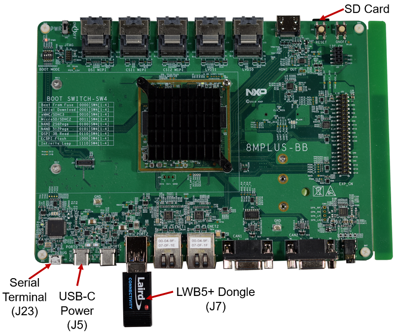
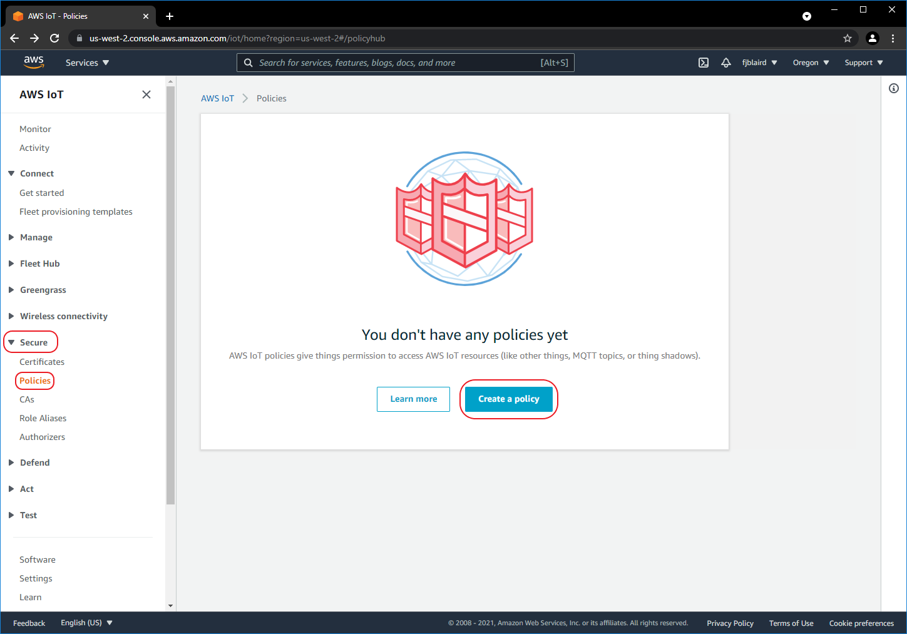

# Sending MQTT Messages to AWS

This tutorial will show you how to send MQTT messages to AWS using Laird Connectivity's Sterling EWB AT Command Firmware.

## Required Tools

   - [EWB dev kit](https://www.lairdconnect.com/wireless-modules/wifi-modules-bluetooth/sterling-ewb-iot-module) (Part No. **455-00030** or **455-00030**)
   - [TTL-2323-3V3](https://ftdichip.com/products/ttl-232r-3v3/) USB to UART Cable

     

## Prerequisites

   - You have flashed the [AT Command FW](https://www.lairdconnect.com/wireless-modules/wifi-modules-bluetooth/sterling-ewb-iot-module#documentation) into the Sterling EWB dev kit. To flash, simply download the FW and run the flash_AT.bat script.

   - You have an AWS account with IoT Core Service.

   - You have PC with Python 3.x.x installed. This demo was done with v3.9.1

   - You have downloaded the [Python Samples Apps from our website](https://www.lairdconnect.com/documentation/command-set-python-sample-applications-sterling-ewb).

     

## Setup

Supply power to the dev kit via J24 and connect the TTL-232-3V3 cable to J7 as shown below.

   

  

1. Create a policy

   - [ ] Navigate to ***Secure->Policies*** and then click ***Create a policy***

     

   

   - [ ] Create the policy as shown below. This will allow the device to connect and publish MQTT messages.

     

     

   - [ ] If the policy was created successfully, you should see the screen below.

     

     

2. Create a Thing (i.e. our Sensor)

   - [ ] Navigate to ***Manage->Things*** and then click ***Create things***.

     

     

   - [ ] Select ***Create single thing*** and then click ***Next***

     

     

   - [ ] Name the thing as ***MySensor*** and then click ***Next***

     	

   - [ ] Select ***Auto-generate a certificate*** and then click ***Next*** 

     

     

   - [ ] Attach the policy that we created to ***MySensor***, by selecting ***MyPolicy*** and then click ***Create thing***

     

     

   - [ ] Download the ***MySensor*** certificate, public and private keys, and the Amazon Root CA certificates into the examples folder of the [Python Samples Apps](https://www.lairdconnect.com/documentation/command-set-python-sample-applications-sterling-ewb).

     

     

     Rename the downloaded MySensor certificate as MySensor.pem.crt. Rename the public key as ***MySensor.public.pem.key***. Rename the private key as ***MySensor.private.pem.key***.

     

   - [ ] ***MySensor*** is now created as shown below

     

     

3. Copy hostaname

   - [ ] aaa

     

   - [ ] aaa

   - [ ] aaa

     

   ```
   BBLAYERS += "${BSPDIR}/sources/meta-laird-cp" 
   ```

   

4. Modify the  *~/projects/imx8mp/build-imx8p-wayland/conf/local.conf* file.  Add the lines below to the file.

   ```
   PREFERRED_PROVIDER_wpa-supplicant = "sterling-supplicant" 
   PREFERRED_PROVIDER_wpa-supplicant-cli = "sterling-supplicant" 
   PREFERRED_PROVIDER_wpa-supplicant-passphrase = "sterling-supplicant" 
   
   BBMASK += " \ 
       meta-laird-cp/recipes-packages/openssl \ 
       meta-laird-cp/recipes-packages/.*/.*openssl10.* \ 
       "
   
   PREFERRED_RPROVIDER_wireless-regdb-static = "wireless-regdb" 
   LWB_REGDOMAIN = "US" 
   ```

   

5. Clone the meta-laird-cp layer into *~/projects/imx8mp/sources* directory

   ```
   cd ~/projects/imx8mp/sources
   git clone https://github.com/LairdCP/meta-laird-cp
   ```

   

6. Edit the *~/projects/imx8mp/sources/meta-laird-cp/recipes-packages/images/sample-image-cp-lwb5plus.bb* recipe by replacing *lwb5plus-sdio-div-firmware* with *lwb5plus-usb-sa-firmware* and adding *laird-networkmanager*. Then save it as *mylwb5p.bb*. A snippet of the saved file is shown below.

   ```
   IMAGE_INSTALL += "\ 
   iproute2 \ 
   rng-tools \ 
   ca-certificates \ 
   tzdata \ 
   alsa-utils \ 
   htop \ 
   ethtool \ 
   iperf3 \ 
   tcpdump \ 
   iw \ 
   kernel-module-lwb5p-backports-laird \ 
   lwb5plus-usb-sa-firmware \ 
   sterling-supplicant \ 
   laird-networkmanager \ 
   " 
   ```

   


7. Next go to the build directory and run menuconfig to configure the Kernel.

   ```
   cd ../build-imx8p-wayland 
   bitbake -c menuconfig virtual/kernel
   
   ```

   - Disable Wireless LAN drivers. Navigate to *Device Drivers* -> *Network device support* and disable *Wireless LAN* .

     

     

     

   - Disable Bluetooth subsystem support and Wireless. Navigate to *Networking support* and disable *Bluetooth subsystem* *support* and *Wireless*.

     

     

     
     
   - Save your changes and exit menuconfig

     

8. Build the image

    ```
    bitbake mylwb5p
    ```

    

9. Flash image into SD card. **Note:** for this particular tutorial the SD card is on /dev/mmcblk0. It may be different for your setup; so make sure you change the command below per your setup.

    ```
    bzip2 -dc ~/projects/imx8mp/build-imx8p-wayland/tmp/deploy/images/imx8mpevk/mylwb5p-imx8mpevk.wic.bz2 | sudo dd bs=512K iflag=fullblock oflag=direct status=progress conv=fsync of=/dev/mmcblk0
    
    sync
    ```

    

10. Connect EVK to Serial Terminal via J23 (115200, N, 8, 1). Note for this tutorial we use */dev/ttyUSB2* port to connect. Your Linux PC might use a different port. Boot device and login as root.

    

11. Test Wi-Fi. Create a connection profile with nmcli. Then connect to the AP and ping a website.

     ```
     nmcli con add con-name "YourProfile" ifname wlan0 type wifi ssid "YourAP" wifi-sec.key-mgmt wpa-psk wifi-sec.psk "YourPassword" 
     nmcli c u "YourProfile" 
     ping www.google.com
     ```

     

     

12. Test Bluetooth. Launch *bluetoothctl*. Then on the *bluetoothctl* prompt, type *power on* and then *scan on*.

     

     

     

## References

- https://github.com/LairdCP/meta-laird-cp
- The modified files on this tutorial
  - [bblayers.conf](../src/dongle/bblayers.conf)
  - [local.conf](../src/dongle/local.conf)
  - [mylwb5p.bb](../src/dongle/mylwb5p.bb)
- https://www.nxp.com/imx8mplusevk