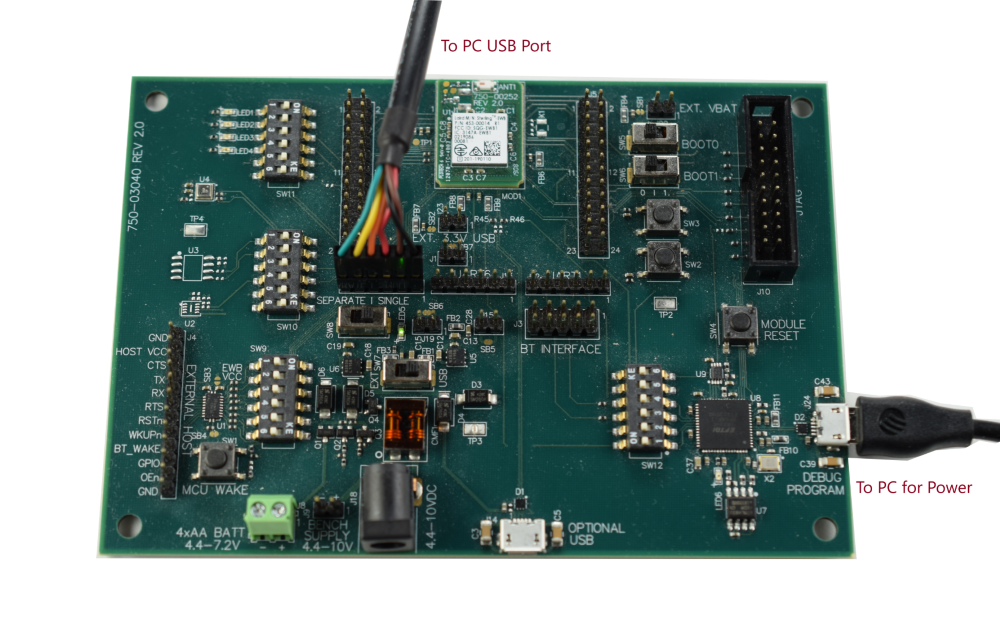

# Sending MQTT Messages to AWS

This tutorial will show you how to send MQTT messages to AWS using Laird Connectivity's Sterling EWB AT Command Firmware.

## Required Tools

   - [EWB dev kit](https://www.lairdconnect.com/wireless-modules/wifi-modules-bluetooth/sterling-ewb-iot-module) (Part No. **455-00030** or **455-00030**)
   - [TTL-2323-3V3](https://ftdichip.com/products/ttl-232r-3v3/) USB to UART Cable

     

## Prerequisites

   - You have flashed the [AT Command FW](https://www.lairdconnect.com/wireless-modules/wifi-modules-bluetooth/sterling-ewb-iot-module#documentation) into the Sterling EWB dev kit. To flash, simply download the FW and run the flash_AT.bat script.

   - You have an AWS account with IoT Core Service.

   - You have Windows PC with Python 3.x.x installed. This demo was done with v3.9.1

   - You have downloaded the [ATCommands_SampleApps](https://www.lairdconnect.com/documentation/command-set-python-sample-applications-sterling-ewb) from our website.

     

## Setup

Supply power to the dev kit via J24. Connect the TTL-232-3V3 cable to J7 as shown below and then connect the other end of the cable to the your Windows PC. Then using Windows device manager determine the com port for the TTK-232-3V3. For this tutorial we will be using ***COM30***.

   

  

1. Create a policy

   - [ ] Navigate to ***Secure->Policies*** and then click ***Create a policy***

     

   

   - [ ] Create the policy as shown below. This will allow the device to connect and publish MQTT messages.

     	

   - [ ] If the policy was created successfully, you should see the screen below.

     

     

2. Create a Thing (i.e. our Sensor)

   - [ ] Navigate to ***Manage->Things*** and then click ***Create things***.

     

     

   - [ ] Select ***Create single thing*** and then click ***Next***

     

     

   - [ ] Name the ***Thing*** as ***MySensor*** and then click ***Next***

     	

   - [ ] Select ***Auto-generate a certificate*** and then click ***Next*** 

     

     

   - [ ] Attach the policy that we created to ***MySensor*** by selecting ***MyPolicy*** and then click ***Create thing***

     

     

   - [ ] Download the ***MySensor*** certificate, public and private keys, and the ***Amazon Root CA certificates*** into the examples folder of the [Python Samples Apps](https://www.lairdconnect.com/documentation/command-set-python-sample-applications-sterling-ewb).

     

     

     Rename the downloaded MySensor certificate as ***MySensor.pem.crt.*** Rename the public key as ***MySensor.public.pem.key***. Rename the private key as ***MySensor.private.pem.key***. 

     

   - [ ] ***MySensor*** is now created as shown below. Next click ***MySensor***.

     

     

3. Copy and save hostname/endpoint into a textfile

   - [ ] Select the ***Interact*** tab and then click ***View Settings***

     

     

   - [ ] Copy the endpoint url and save into a textfile. We will need this later when we run our Python sample scripts.

     

   

4. Setup the AWS MQTT Test Client.

   Navigate to ***Test->MQTT test client***. Enter ***#*** on the ***Topic filter***.  Expand ***Additional configuration*** and select ***Display payload as strings***. Then click ***Subscribe***. ***#*** should be added to ***Subscriptions***.
   
   
   
   
   
5. Send MQTT messages from the EWB

   - [ ] Open a ***cmd prompt*** on the ***ATCommands_SampleApps*** ***examples*** folder

   - [ ] Connect to an AP using the ***join.py*** script

     ***join.py -u COM30 -s NameOfYourAP -p YourPassphrase***

   - [ ] Load the ***MySensor*** certifcate and private key into the EWB with the ***client_cert.py*** script

     ***client_cert.py -u COM30 --cert MySensor.pem.crt --key MySensor.private.pem.key***

   - [ ] Send a message with the ***mqtt.py*** script

     ***mqtt.py -u COM30 -p 8883 --host TheEndPointURLYouCopiedFromStep3 --ssl NoVerifyHost --topic test/topic --body Hello***

     

   

   - [ ] Hello message received on the AWS MQTT Test Client

     

   
